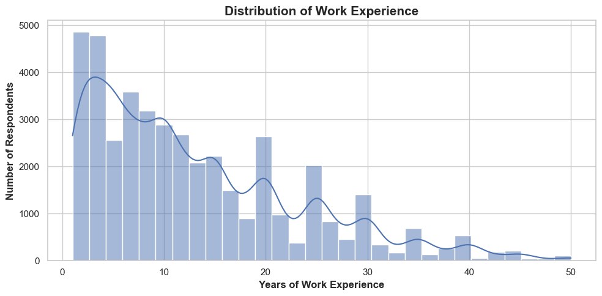
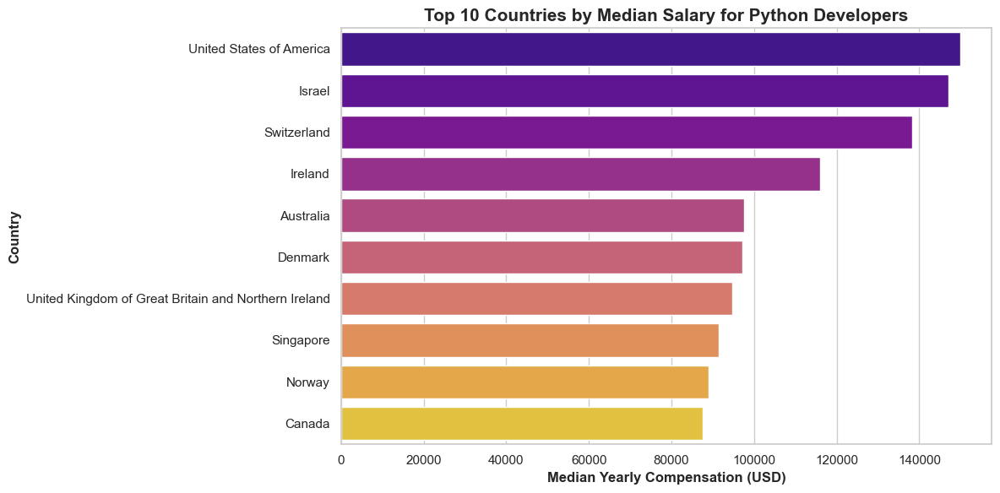
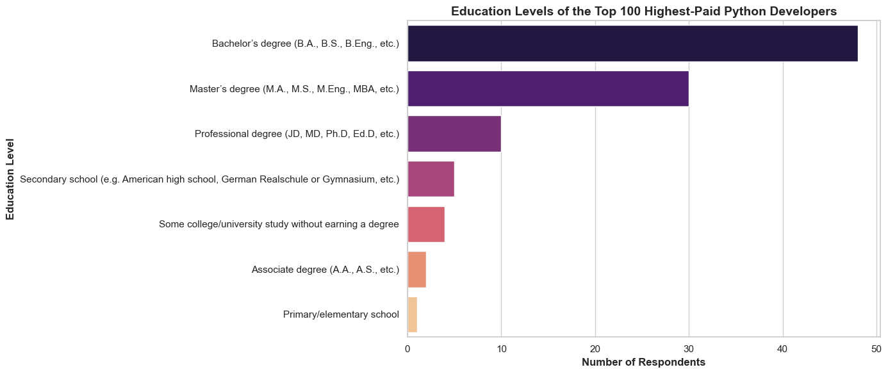

 # 📊 Python Developer Salary Analysis (Stack Overflow Survey 2025)

### Exploring how experience, location, and education influence developer compensation worldwide

---

## 📌 Overview

This project explores global developer trends using the **Stack Overflow Developer Survey 2025**, with a particular focus on **Python developers and salary patterns**.

The analysis aims to answer a key question:

> **What factors influence developer salaries globally, and how do Python developers compare across different regions?**

The project combines general developer insights with a focused analysis of Python developers to uncover meaningful, data-driven patterns.

---

## 🎯 Objectives

- Understand the **distribution of developer experience and education**
- Analyze the **global adoption of Python**
- Identify **salary differences across countries**
- Evaluate how **education relates to high-paying roles**
- Highlight **limitations and biases in real-world survey data**

---

## 📂 Dataset

- Source: Stack Overflow Developer Survey 2025  
- ~65,000 responses  
- 180+ countries  
- Includes data on salary, technologies, education, and work preferences

---

## 🧹 Data Cleaning & Preparation
- Removed duplicate entries based on `ResponseId`.
- Removed missing values in key columns (e.g., `WorkExp`, `ConvertedCompYearly`)
- Filtered unrealistic values (e.g., >50 years of experience)
- Standardized compensation data for cross-country comparisons

---

## ⚙️ Methodology

The analysis was performed using **Python (Pandas) in Jupyter Notebook**:

- Performed exploratory data analysis (EDA)
- Segmented Python developers
- Aggregated salary data by country
- Used **median** to reduce the impact of outliers
- Filtered data based on sample size for reliability
- Visualized data using Matplotlib and Seaborn

## 📊 Results & Insights

### 🧠 Developer Experience Distribution

- The distribution is **right-skewed**, with a large proportion of developers having less than 15 years of experience 
- Median experience is significantly lower than the maximum values, indicating the presence of outliers  
- This reflects a **growing and relatively young developer population**

---

### 🐍 Python Adoption

- Python is used by **~37.5% of developers**, making it one of the most widely used programming languages
- Its adoption spans across different experience levels, indicating both **entry-level accessibility and long-term relevance**

---

Given Python’s high adoption, it serves as a useful case study for exploring salary differences within a specific developer group.

---

### 💰 Python Developer Salaries by Country

- Median salaries among **Python developers** vary significantly across countries, with top countries earning **up to 4–5x more** than lower-paying regions  
- The United States, Israel, and Switzerland show the highest compensation levels  
- This shows how strongly location influences developer salaries  

⚠️ **Important considerations:**
- Sample size differences between countries  
- Cost of living variations  
- Remote work dynamics  
---

### 🎓 Education Among Top-Paid Python Developers

- Among the highest-paid **Python developers**, Bachelor’s and Master’s degrees are the most common  
- However, high salaries are also observed among developers without formal degrees  
- Education appears to be helpful, but it is not required for high earnings

---

## 💡 Key Takeaways

- **Geography is one of the strongest drivers of salary differences**
- Python developers show **significant global salary variation**
- **Experience likely plays a larger role than formal education**
- Small sample sizes can distort rankings and must be handled carefully  
- Real-world data requires **critical interpretation, not just visualization**

---

## ⚠️ Limitations

- Salary data is **self-reported**
- Some countries have limited representation  
- Remote work may distort country-based comparisons  
- The dataset does not fully capture cost-of-living differences  

---

## 🚀 Future Improvements

- Analyze **salary vs years of experience**
- Compare Python with other programming languages  
- Investigate **remote vs on-site salary differences**
- Incorporate **sample size directly into visualizations**
- Apply basic statistical modeling (e.g., regression)

--- 

## ▶️ How to Run

1. Download the dataset from the Stack Overflow Developer Survey  
2. Place CSV files into the `data/` folder (create it if needed)  
3. Open `analysis/eda_python.ipynb` in Jupyter Notebook  
4. Run all cells
   
> Note: The dataset is not included in this repository due to its size.

---

## 🛠 Tools Used

- Python  
- Pandas  
- Matplotlib  
- Seaborn  
- Jupyter Notebook  

---

## 👤 About Me

Hi there! I’m Iryna 👋

I’m currently transitioning into Data Analytics and building my skills through hands-on projects like this one. I’m especially interested in working with messy, real-world data, asking better questions, and finding meaningful insights in complex datasets.

In this project, I analyze developer survey data to understand how factors like experience, location, and education relate to salary.

---

📜 License  
This project is licensed under the MIT License.
